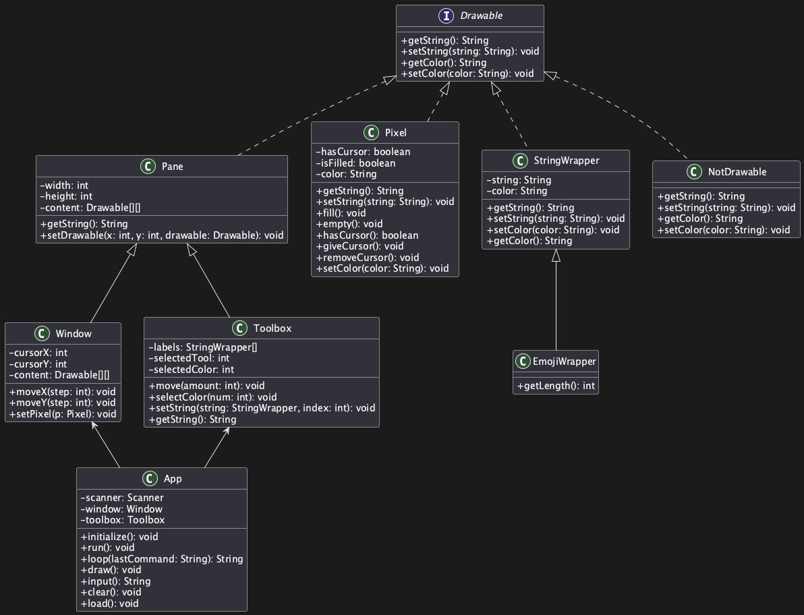

# Paint©

Property of PaintCo.
No rights reserved.

# Demo

# Entry point

## App.java

- Does the greeting and loading
- Runs the program loop
  - Asks the user for input
  - Draw main window and toolbox

## App.java

```java
  public String loop(String lastCommand) {
    clear();
    System.out.println(window.getString());
    System.out.println(toolbox.getString());
    String command = input();
    command = command.toLowerCase();

    if (command.equals("")) {
      command = lastCommand;
    }

    for (int i = 0; i < command.length(); i++) {
      char currentCommand = command.charAt(i);
      switch (currentCommand) {
        case 'a':
          window.moveX(-1);
          break;
        case 'd':
          window.moveX(1);
          break;
        // etc.
      }
    }

    return command.toLowerCase();
  }
```

# Toolbox

## Toolbox.java

- Draws icons that can be selected
- Tells App.java the selected tool and color

```java
  private String makeBox(StringWrapper[] labels) {
    String out = "";

    int[] lengths = new int[labels.length];

    // Calculate length array
    for (int i = 0; i < labels.length; i++) {
      lengths[i] = labels[i].getLength();
    }

    // Draw top row
    for (int i = 0; i < labels.length; i++) {
      int length = lengths[i];

      // Draw corner
      if (selectedTool == i || selectedColor == i) {
        out += "┌";
      } else {
        out += " ";
      }

      // Draw top edge
      for (int j = 0; j < length; j++) {
        if (selectedTool == i || selectedColor == i) {
          out += "─";
        } else {
          out += " ";
        }
      }

      // Draw corner
      if (selectedTool == i || selectedColor == i) {
        out += "┐";
      } else {
        out += " ";
      }
    }
    out += "\n";

    // Draw middle row
    // Draw section left-right border
    for (int i = 0; i < labels.length; i++) {
      if (selectedTool == i || selectedColor == i) {
        out += "│";
      } else {
        out += " ";
      }
      // Draw label
      out += labels[i].getString();
      if (selectedTool == i || selectedColor == i) {
        out += "│";
      } else {
        out += " ";
      }
    }
    out += "\n";

    for (int i = 0; i < labels.length; i++) {
      int length = lengths[i];

      if (selectedTool == i || selectedColor == i) {
        out += "└";
      } else {
        out += " ";
      }

      for (int j = 0; j < length; j++) {
        if (selectedTool == i || selectedColor == i) {
          out += "─";
        } else {
          out += " ";
        }
      }

      if (selectedTool == i || selectedColor == i) {
        out += "┘";
      } else {
        out += " ";
      }
    }
    return out;
  }

```

# Main window

## Window.java

- Handles the drawing of the pixels
- Manages the cursor position and pixels

## Cursor Movement

```java

  public void moveY(int step) {
    Pixel pixel = (Pixel) (content[cursorY][cursorX]);
    pixel.removeCursor();

    cursorY += step;
    cursorY = Math.max(0, cursorY);
    cursorY = Math.min(height - 1, cursorY);

    Pixel newPixel = (Pixel) (content[cursorY][cursorX]);
    newPixel.giveCursor();
  }
```

## Setting a pixel

```java
public void setPixel(Pixel p) {

    p.giveCursor();
    content[cursorY][cursorX] = p;
  }
```

# UML

##


